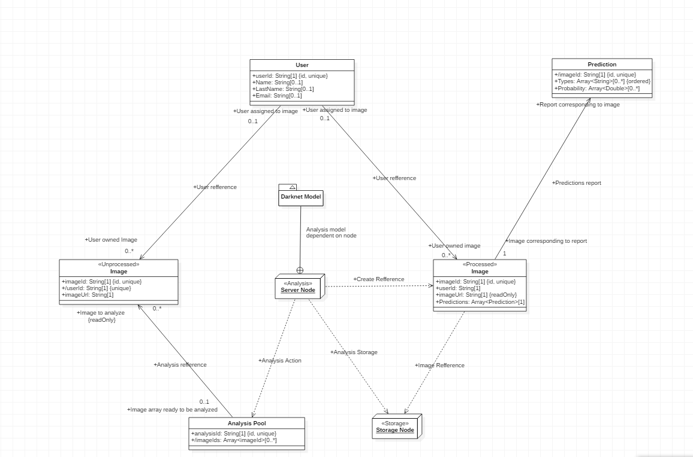
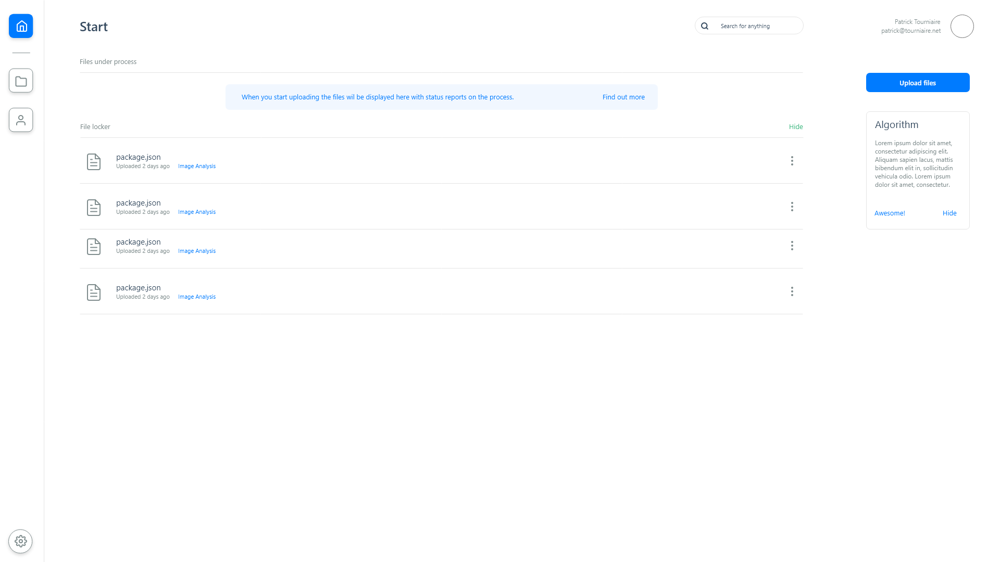
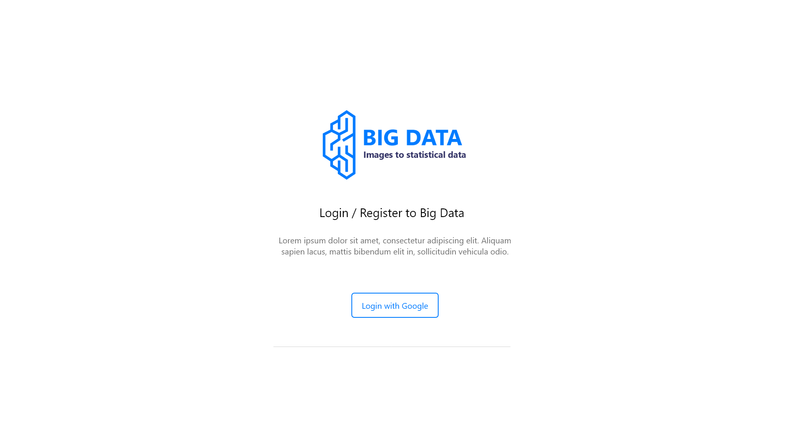

# Big Data - Statistical Analysis from Images

## Introduction
Big Data is a project I created to preform statistical analysis on images. The project is using the Darknet YOLOv3 model under the hood and is using Firebase for data handling. Furthermore, the project was created primary for **my own educational development. **

## Data Model
This project relies on an external node or server if you will. This node listens for changes in the Firebase data pool which you can find documented in the picture below. The node adds this to the processing que and begins the analysis when it is ready. With this model you can attach as many nodes as possible and you could setup a node with only one script. 

## Darknet setup with YOLOv3
This setup is quite straight forward. Just follow the instructions from [the official darknet website](https://pjreddie.com/darknet/yolo/). When that is done you can drop the **firebase_handler.py** from python/server/firebase_handler.py into the Darknet parent directory. After that you need to configure an ftp-connection to your node.

## Front-end Screenshots
| Main Sreen                    | Login Screen                 |
| ------------------------------|------------------------------|
|   |  |

## Credits

[Darknet YOLOv3](https://pjreddie.com/darknet/)

[Firebase](https://firebase.google.com/)

[MustacheJS](https://github.com/janl/mustache.js/)

[JQuery](https://jquery.com/)

